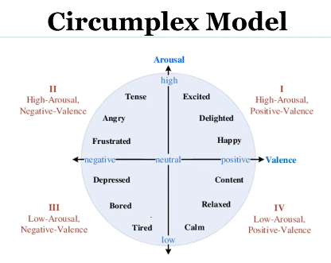

# Affective computing Week 2

> Lecture 1 - Emotion Psychology

Emotion is a complex set of interactions among subjective and objective factors, mediated by neural/hormonal systems, which can
- Give rise to affective experiences such as feelings of arousal, pleasure/displeasure
- Generate cognitive processes such as emotionally relevant perceptual effects, appraisals, labeling processes
- Activate widespread physiological adjustments to the arousing conditions
- Lead to behavior that is often, but not always, expressive, goal, directed, and adaptive
  
### Emotions Generation 
- Run away from Bear (Afraid of run or bear) - James 1894

### Bidirectional Projections
- Brain impacts the body and vice versa (Solution is Laughter yoga)
- Voluntary contraction of facial muscles
- People who forced the pencil in mouth to control smile didnt feel the cartoons amusing

### Emotion models
- Perceived emotion recognized by stimuli
- Induced emotion experienced by the listener
- Representaion of emotions
  1. Discrete or Categorical models
  2. Dimensional models

> Lecture 2 - Types of emotion model

- Single word is used to represent the emotion
- Six basic emotions (P. Ekman and W. Friesen, 1971)
  1. Happiness
  2. Anger
  3. Disgust
  4. Sadness
  5. Anxiety
  6. Surprise

- Categorical
  1. Cant model relation between the discrete emotions
  2. Inconsistence

- Dimensional
- 3D numerical vector denotes the location of an emotion
  1. VAD/PAD model (Russell and Mehrabian, 1977) - Vector with distance between emotion states
  2. Pleasure and Displeasure (Pleasantness), Arousal and Non-Arosal (Intensity/Energy), Dominance-Submissiveness (Controlling and Dominant nature of emotion)

- PAD model
- Applying regression methods and studies that discretize dimensions into few areas
- Overcome limitation of relating affective states to each other by providing a distance between them
- 3D is ignored so we use circumplex model

### Problems in traditional AC
- Small amount of accumulation of continued weak stimuli over a period of time can stimulate a emotion as well as emergency emotion
- Emotions are quick and low-precise 

- Specificity of the emotions (Single set of emotions can become different emotional expressions in different context)

- Fear by Frontoparietal brain regions, HRV also heart rate variability is reduced

> Lecture 3 - Brain and Asymmetry
1. Fear
  - Eyebrows, lowered eyelids and stretched lips
  - Skin conductance by larger electromyographic (More means Fear)

2. Anger
  - Lowered eyebrows tense lowered eyelids and pressde lips
  - Left frontal pre frontal cortex is activated and No change in HRV

3. Disgust
  - Raised upper lips, wrinkled nose bridge and raised cheeks
  - Core-dsiguts or Body-boundary violating stimuli causes skin conductance response

4. Sadness
  - Crying 
    - Raised inner eyebrows and lowered lip corners
    - Increased Heart rate but no change in HRV and increased skin conductance
  - Non crying 
    - Reducation in heart rate
    - Reduced HRV and skin conductance increased respiration

5. Happiness
  - Tensed lower eyelids, raised cheeks and raised lip corners
  - Medial prefrontal and temporo parietal cortices
  - Decreased HRV for happiness and for amusement and joy are associated with increase

- Left side of brain then more of +ve emotions
- Right side of brain then more of -ve emotions
- But in case of anger its vice versa

> Lecture 4 - Emotional Design
- Creating of the design results in +ve emotions
- Spacing, brand, colors
- Visceral (Initial impression - Subjective - Motor output)
- Behavioral (Useability - Objective)
- Reflective (Rationalization - Intellectual - Experience)

### Affective computing Emotional Design
- Visceral design: Understand users 1st response (Face response - momentar reaction)
- Behavioral design: Understand Emotional exp when user is using the product
- Reflective design: Understanding the emotions after Post-usage of the product

### Assignment 
1. Which brain region is primarily involved in regulating emotional experience and motivation?
   - Prefrontal cortex ✅
   - Occipital lobe
   - Cerebellum
   - Pituitary gland

2. The amygdala is most strongly associated with which function?
   - Decision making and planning
   - Regulation of voluntary movement
   - Processing stimulus salience and arousal ✅
   - Language comprehension

3. According to embodied cognition theories, voluntary facial muscle contraction can influence emotional experience. This idea supports which concept?
   - Emotions exist independently of bodily states
   - Emotion cannot occur without a conscious appraisal
   - Emotion is generated only through cognitive evaluation
   - Bodily feedback contributes to how emotions are felt ✅

4. Higher activation in the left frontal hemisphere is generally linked to which motivational tendency?
   - Withdrawal motivation
   - Approach motivation ✅
   - Reduced emotional awareness
   - Neutral affect

5. Which emotion is commonly associated with activation of the left frontal PFC, despite being negatively valenced?
   - Fear
   - Sadness
   - Anger ✅
   - Disgust

6. In the dimensional VAD/PAD model, dominance refers to:
   - The sense of control or submission associated with an emotion ✅
   - The pleasantness of an emotional state
   - The intensity or energy of an emotion
   - The clarity with which an emotion is recognized

7. One limitation of traditional categorical emotion models is that:
   - They cannot be implemented computationally
   - They struggle to represent relationships between emotions ✅
   - They include too many dimensions to be practical
   - They ignore facial expressions entirely

8. Which emotion is typically characterized by lowered eyebrows, tense eyelids, and pressed lips?
   - Happiness
   - Fear
   - Disgust
   - Anger ✅

9. Increased skin conductance is most reliably associated with which type of disgust-related stimulus?
   - Pictures of dirty toilets
   - Pleasant odors
   - Mutilation or body-boundary violation images ✅
   - Neutral facial expressions

10. Crying-related sadness is associated with which physiological pattern?
    - Reduced respiration and lower HRV
    - Increased heart rate and increased skin conductance ✅
    - Decreased skin conductance and reduced heart rate
    - No change in respiration but reduced HRV

