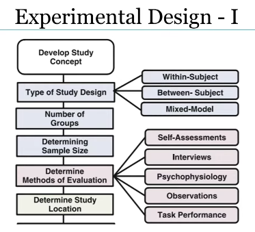
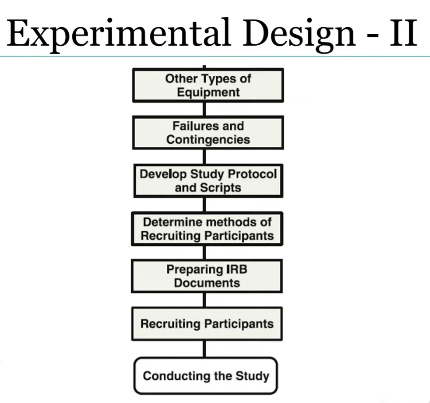
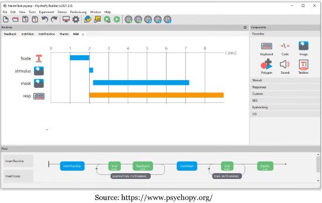
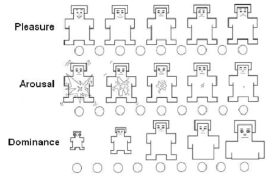

# Affective computing Week 3

> Lecture 1 - Affect Elicitation

## Dataset of emotional expression
1. Acted or pose expression 
2. Naturalistic display of emotions
3. Induced expression (elicited via some stimulus)  (Middle road)

## Passive or Active
- Passive or preception based (Individual observe stimuli like images, music or something to evoke particular feeling)
- Active or Expression based (Perform particular behaviour)

## Passive methods
- Present a particular image or video to the subject and ask them to see and then same emotion is being expressed by them (Fixed screen distance, resolution and brightness)

### Standard set of iamges
  1. International Affective Picture System (IAPS)
  2. Geneva Affective Picture Database (GAPED)

### IAPS
1. Awe
2. Excitement
3. Anger
4. Contentment
5. Amusement
6. Disgust
7. Fear

### Advantages
1. Non-Invasive
2. Easy to collect
3. Relatively simple setup

### Disadvantages
1. Strength of emotion is lower
2. Emotional reaction are short and transient
3. Lack of personalization

### Utilizing
- May be useful for reactive modalities such as facial expression, physiological signals
- Not for productive modalities

### Film clips
- Base line film clips (For neutral state)
- Emotional film clips (For emotional state)
- Then self assessment
- Short clips, long clips
- Physical situtaion should be standardized
- Target emotion can have 1 or 2 short clips as homogenous as possible
- Capture attention well
- Higher intensity emotion latency, rise time, duration, and offset
- Ecological validity
- Individual may have seen the clips

## Active Methods

### Behavioral Manipulation
- Facial emotion expression
- Directed Facial action task
- Ask participants to recall emotions based on the past events

- Advantage
    - Useful for collection reactive expression
    - If physical behaviour associated then emotions are more precise and strong

- Disadvantage
    - Are my emotions pure?
    - Physical behaviour needs to be know for target emotion
    - Limits the range of target emotions

> Lecture 2 - Experimental Methodology

## IRB for Human Research
- Institutional Review Board
- Protects the rights and welfare of human research subjects
- Document for IRB
    - Draft a abstract of the proposal
    - A copy of the informed consent forms
    - A description of how confidentiality/anonymity will be maintained
    - A description of the risks and benefits of the subjects
    - How are we going to recruit the participants
    - Instrument, hardware/device, sensors used for data collection

## Criteria for selection of participants
- Risks to subject are minimized or reasonable
- Selection of subject is equitable
- Informed consent will be obtained from each subject
- Informed consent will be documented
- Informed consent will be obtained before the subject participates in the research
- Additional safeguards for vulnerable population

## Emotion Design I

## Emotion Design II

## Research and Development Tools

### Category of tools
- Data Collections
- Data Annotation
- Signal Analysis
- Affect Classification
- Affect Expression

### Data collection
- PsychoPy
- OpenSesame
- Experiment Wizard
- SuperLab
- E-Prime
- Presentation
- DMDX
- Paradigm
- In-house

### PsychoPy
- Open source and Free
- Python based
- Cross platform

### Data annotation (Ground Truth)
- Genova Emo Wheel
- Self assessment Mankins (SAM)
- Feeltrace
- Audio
    - ELAN
    - Wavesurfer
    - Praat
    - Speechalyzer
- Video
    - ELAN
    - Cowlog
    - ANVIL
    - Gtrace
    - ChronoViz
- Text
    - Whissell Dictionary of Affect in Langauge
- Image/Video
    - OpenCV
    - OpenPose
    - MediaPipe
    - Kinnect SDK
- In-house

### SAM Mankins
- Self assesment mode using PAD

## Data Mining
- WEKA
- AutoML
- SPSS
- PRTools
- MATLAB Arsenal
- R
- LibSVM
- SVMLight
- SAS
- RapidMiner
- SciPy

## Affect Expression
- MARY
- GRETA
- Festival
- VHML
- SmartBoddy
- FaceFX
- Xface
- Horde3D
- ROS
- ICT Virtual Human Toolkit
- SOAR
- ACT-R

### Assignment 
1. Which type of emotional expression dataset is easiest to collect but suffers from low ecological validity?
   - Acted or posed expressions ✅
   - Naturalistic expressions
   - Induced expressions
   - Behavioral manipulation datasets

2. In emotion elicitation, which method involves observing film clips or images designed to evoke emotions?
   - Social interaction
   - Passive/perception-based methods ✅
   - Directed facial action tasks
   - Productive modality elicitation

3. A key disadvantage of using images for passive elicitation is:
   - Setup is too complex
   - Emotional reactions are short and transient ✅
   - Images cannot be standardized
   - Images elicit too intense emotions

4. Which passive method generally includes a neutral baseline clip before emotional clips?
   - Facial action tasks
   - Social interaction
   - Film clip–based elicitation ✅
   - Gesture-based elicitation

5. Directed Facial Action Tasks are primarily used in:
   - Behavioral manipulation methods ✅
   - Passive emotion elicitation
   - Baseline emotional calibration
   - IRB risk assessment

6. One major advantage of social interaction–based elicitation is:
   - The emotions elicited are highly controllable
   - It is effective for collecting productive modalities
   - Emotions produced are realistic and natural ✅
   - Participants do not require instruction

7. Which document is required when submitting a study for IRB review?
   - A participant payment receipt
   - A full literature review
   - A published version of the experiment
   - A copy of the informed consent form ✅

8. Which of the following is not a criterion for IRB approval?
   - Risks to subjects must be minimized
   - Adequate privacy and confidentiality protection
   - Ensuring participants enjoy the experiment ✅
   - Selection of subjects must be equitable

9. Tools such as PsychoPy, OpenSesame, and SuperLab fall under which category?
   - Affect expression tools
   - Data collection tools ✅
   - Data mining tools
   - Annotation tools

10. SAM (Self-Assessment Manikin) is primarily used for:
    - Image labeling
    - Physiological signal cleaning
    - Facial expression synthesis
    - Measuring emotional responses along dimensions like valence and arousal ✅
