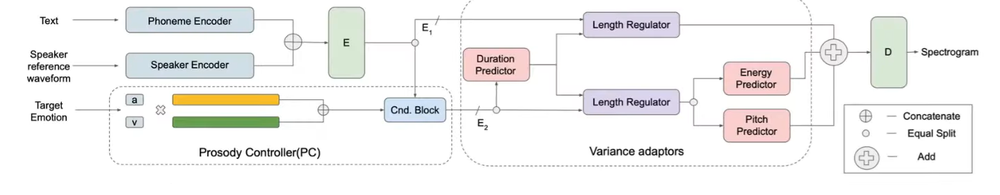

# Affective Computing - Week 5

> Lecture 1 - Voice Modality

## Speech in Affective computing
- Man machine interaction on a nautral basis
- Computer movies and tutorial applications
- Drivers safety via car on board system in which coded message of the driver's mental state is conveyed to the OS of the car
- Diagnostic tool for a therapist to treat disease
- Automatic translation system
- Mobile communications

## Difficulties
- What is said
- How it is said
- Who says it

## Types of Database
- Natural (Spontaneous speech in meeting and calls and conversation, cockpit and doctors, conversation emotions in public places and similar interactions)
- Simulated (Acted)
- Elicited (Induced)

## Existing Datasets
- AIBO (110 dialogues and 29.2k words in 11 emotion category of anger, boredom, emphatic, helpless, ironic, joyful, reprimanding, rest, surprise, touchy)
- Berline Database (10 actors, 5 male and 5 female - acted 10 german sentences)
- Ryerson audio visual database of eomtional speech and song (RAVDESS) (24 professional actors 12 female, 12 male, vocalizing two statements in a neutral North american accent - Acted)
- IITKGP-SESC (5 male and 5 female - 15 telugu sentences in 8 basic emotions - Acted)
- IITKGP-SEHSC (5 male and 5 female - All India Radio - Acted) 
- Total of 12k (15 sentences * 8 emotions * 10 artists * 10 sessions)
- Computational Paralinguistic Challenge (ComParE)
- EMPATHIC grant database

## Speech Annotations Audino
- To label the audio with the transcript with the emotions at the give point of time

## Limitations
- Limited work on non-english languages
- Limited number of speakers
- Limited Natural database
- Limited work on emotion synthesis through speech
- Limited work on cross lingual emotion
- Insights of ML based methods is available but on DL based methods are limited

> Lecture 2 - Automatic Speech Analysis Affecct Sensing

## Features
- Prosody features (Related to rhythm, stress and intonation of speech)
  - Fundamental frequency (fo)
  - Short term energy
  - Speech rate, syllable/phoneme rate

## Spectral characteristic 
- Mel freq cepstral co-efficient (MFCC's)
- Mel filter bank energy co-efficient (MFB's)

### Commmon Prosody features
- f0
- f1
- f2
- Speech rate
- Spectral energy
---
- Amplitude (+ve and -ve)
- Pitch (+ve and -ve)
- Good vibrations
  - +ve vaiablility in loudness, high variable pitch
- Feature Normalization
  - Angry has high f0
  - Speaker normalization
  - f0 (Men 50 to 250Hz) (Women 120 to 500Hz)
- Common approaches
  - Z-score
  - Min-max
  - Normal distribution

### Iterative feature normaliation
- Apply single normalization across the entire corpus can adversely affect the emotional discrimination of the features
- Estimating the features using only neutral (non-emotional) use this as baseline for normalization
---
- First, acoustic features without any normalization are used to detect
expressive speech (neutral versus emotional classes).
- The observations that are labeled as neutral are used to re-estimate
the normalization parameter
- As the approximation of the normalization parameters improves,
the performance of the detection algorithm is expected to improve,
leading to better normalization parameters.
- The process is repeated until the percentage of files in the
emotional database that change labels from successive iterations is
lower than a given threshold (say 5%).

## Typical ML techniques
- Traditional
  - Hidden Markov models
  - Conditional random fields
  - Support Vector Machines
  - Random forest

- Deep learning
  - CNN
  - RNN

## Speech emotion recognition
- Spectograms of audio in terms of frequency
- Emotion enhanced speech synthesis (Amazon Alexa - Text to speech)
- Spectogram how is it calculated

## Open Challenges
- Inter and Intra speaker variability
- Heterogenois display of motions
- A speaker can express an emotion in a number of ways and is influenced by the context (speaking with elders and young ppl with same content)
- What aspects of emotions Production-perception mechanism are captured with the acoustic features
- Exhaustive and computationally expensive

## Research challenges
- Interspeech 2009
- Audiovisual emotion challenge 2011
- Interspeech computational paralinguistic challenge
- Emotion in the Wild challenge
- Multimodel emotion challenge 2016 and 2017

## Assignment
1. Which of the following is not an application of speech in affective computing?
   - Driver safety monitoring
   - Mobile communications
   - Diagnostic tools for therapists
   - Face recognition unlocking ✅

2. According to Borden et al. (1994), “how it is said” refers to:
   - The linguistic meaning of the words
   - Paralinguistic information reflecting emotional state ✅
   - Speaker identity characteristics
   - Speech segmentation rules

3. Natural emotional speech databases primarily include:
   - Speech from trained actors
   - Emotionally synthesized speech
   - Spontaneous speech from real-world scenarios ✅
   - Scripted dialogues recorded in studios

4. Positive emotions always produce lower variability in pitch.
   - True
   - False ✅

5. The Berlin Emotional Speech Database contains recordings of:
   - Children interacting with robots
   - Professional actors producing emotional German sentences ✅
   - North American speakers producing neutral statements
   - Patients and doctors in clinical settings

6. Prosody features include:
   - MFCCs
   - SIFT descriptors
   - Fundamental frequency and short-term energy ✅
   - Visual intensity curves

7. MFCCs are primarily used to represent:
   - Resonant spectral characteristics ✅
   - Rhythm and intonation patterns
   - Speaker identity features
   - Amplitude variations across time

8. Positive voices typically show which characteristic?
   - Low pitch and low formant frequencies
   - Low speech rate
   - Flat and monotone amplitude
   - High loudness variability and high formant frequencies ✅

9. A key problem with global normalization of f0 across all speakers is that it:
   - May blur emotional differences due to speaker-specific traits ✅
   - Reduces background noise
   - Is too computationally expensive
   - Requires manual annotation

10. One major open challenge in speech-based affect recognition is:
    - Oversupply of natural databases
    - Inter- and intra-speaker variability ✅
    - Perfect cross-lingual generalization
    - Excessive real-time deployment success
