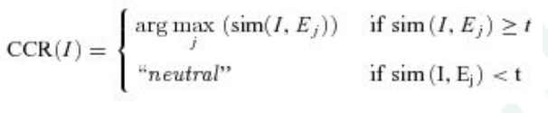
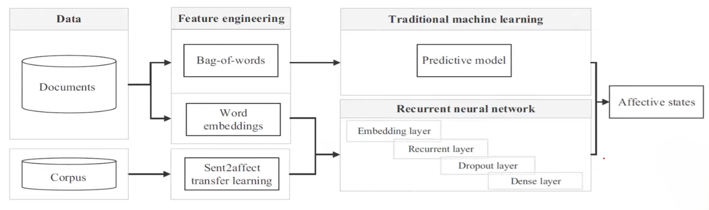
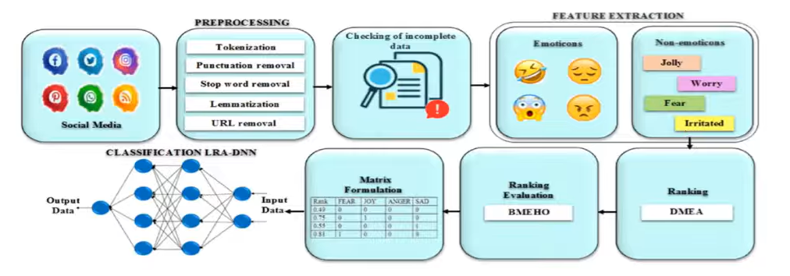
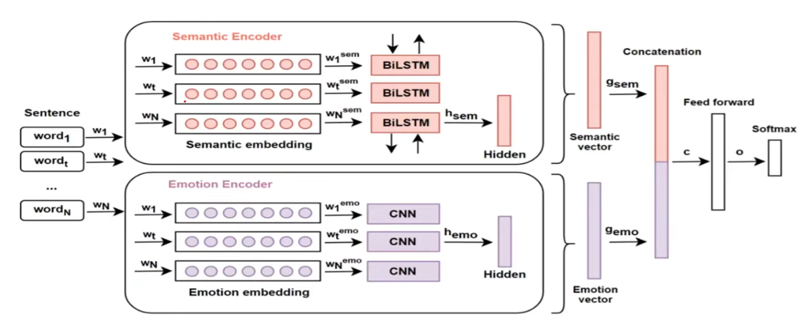
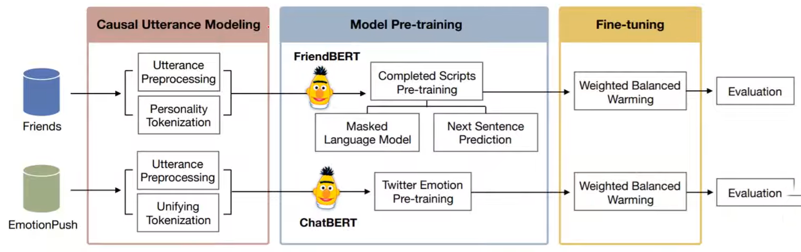
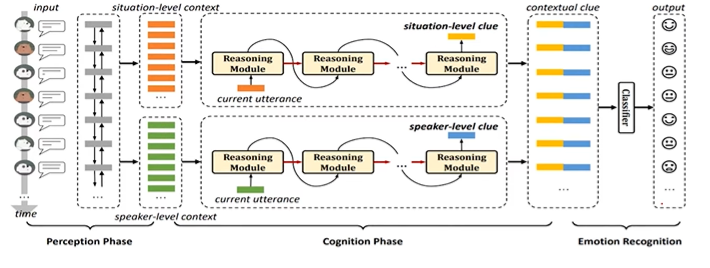
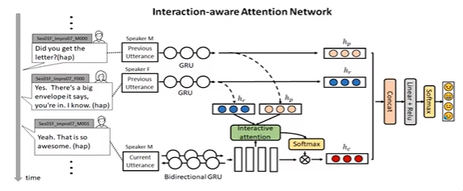

# Affective Computing - Week 6

> Lecture 1 - Text modality

## Application
- What is being said
- How is it being said
- Sentiment analysis
  - Text categorization according to affective relevance 
  - Opinion exploration for market analysis
- Computer assisted creativity
  - Automatic personalized advertising and persuaive communication
- Verbal feedback
  - Affective word selection and understanding are crucial
  - Question answering systems

## Emotion through typography
- Font style, placement
- Poffenberger and Barrows (1924) - A line going downwards was shown to make us feel “doleful,” while a “joyous” like takes our eyes upwards.
- Articles received ratings as being funnier and angrier, in other words more satirical, when it was read in Times New Roman in comparison to Arial. Juni, S., & Gross, J. S. (2008)

## The Aesthetics of Reading
- Good typography does elevate mood (Larson, K & Picard)
- Relative subjective duration (RSD)
- Good typography took 3 min 18 seconds avg
- Poor typography took 24 seconds more then avg
- (+ve and -ve emotions)
- Fearful (Pessimistic) and Angry (Optimistic)
- Fear is passive emotion and Anger is more of an active emotion

## Categorical/Dimensional
- Dimensioanl models are not used rarely
- Fear (Valence: -ve, Arousal:: Low/High, Dominance: Submissive)
- Anger (Valence: -ve, Arousal:: Low/High, Dominance: Submissive)

## Metaphors
- He lost his cool - angry
- You make my blood boil - angry
- Systematic investigation
- Multi-class classification
  - Complexity of human emotions
  - Implicit expression
  - Frequent use of metaphors
  - Importance of context in identifying emotions
  - Cross culture and intra-culture variations of emotions

## Database
- ISEAR (2k ppl tell abt 7 major emotions)
- EmotiNet knowledge base (Cluster each emotion based on the language similarity)
- Alm's annotated fairy tales (1580 sentance from children fairy tales)
- SemEval-2007 (1250 news headlines)

## Affective Lexical Resources
- ANEW
  - 2k words (3D valance, arousal, dominance)

- SentiwordNet
  - Obj(s) = 1 - [Pos(s) + Neg(s)]

- NRC word emotion association lexicon
- Crowd source 14k words in english and converted to other language using google translate

## Other Lexical resources
-  Linguistic Inquiry and word count (6.4k annotated emotional words - 70+ classes)
-  WordNet affect (Subset of WORDNET - 2004)
-  DepecheMode (35k crowd sourced words 2014)

## Recognizing - Unsupervised
- For categorical models, NRC can be used as the lexicon.
- For dimensional models, ANEW can be used as lexicon.
- Then the emotion of the text can be assigned based on closeness (cosine similarity) of its vector to the vectors for each category or dimension of emotions (Kim et. al, 2010).
- If we define the similarity between a given input text, I, and an emotional class, Ej, as sim(I, Ej), the categorical classification result, CCR, is more formally represented as follows:

> Lecture 2 - Features and Method of Text analysis

## Features
- Bag of Words and TF-IDF
- n-grams

## Text based emotion recognition
- Mood classifications
- Large dataset 815494 post from blogs from LiveJournal
- 132 mood
- Frequency (BOW) and Part of speech (noun, verb)
- Feature - Pointwise mutual information
- PMI-Information retrieval - probablity of PMI using search engine hits
- Word2vec
- FastText
- Glove

## Representation Learning based features
- Word2Vec
  - Ability group together vectors of similar words
  - A function W (word) returning a vector encoding that word
  - Predict words using context
  - CBOW (Continnuous bag of words) and Skip-gram
  - CBOW many to one prediction
  - Skip-gram one to many prediction

- Glove
  - Unsupervised technique
  - Global word-word co-occurrence matrix

- Text mining (Bag of concepts) -> Raw Corpus -> Word2Vec -> Spherical K-Means -> Weighting Scheme (CF-IDF) -> Document Vectors

- Deep learning for AFC Text based emotion recognition using decision support using RNN

- Emotiocons using both text and emojis

- Semantic Emotion Neural Network for emotion recognition from text

- BERT

- DialogueContextualReasoningNetworks

- Interaction Aware neural network

## Assignment

1. ANEW is a categorical lexicon used to label text with Ekman’s six universal emotions.
	- True
	- False ✅

2. According to Poffenberger & Barrows (1924), upward-moving lines tend to evoke which feeling?
	- Calmness
	- Joy ✅
	- Fear
	- Anger

3. Juni & Gross (2008) found that articles were perceived as more satirical when written in:
	- Arial
	- Georgia
	- Times New Roman ✅
	- Verdana

4. Relative Subjective Duration (RSD) experiments showed that good typography led participants to:
	- Underestimate reading time less
	- Overestimate reading time greatly
	- Underestimate reading time more ✅
	- Read significantly slower

5. Why is positive/negative sentiment analysis often insufficient?
	- Emotions with similar polarity (e.g., fear vs. anger) differ in relevance and meaning ✅
	- Most texts contain no sentiment
	- It cannot detect sarcasm
	- It is computationally expensive

6. Implicit expressions of emotions (Lee, 2015) refer to:
	- Emotions directly stated via adjectives
	- Physiological signals embedded in text
	- Metaphors expressing emotional states
	- Emotion conveyed without explicit emotional words ✅

7. Metaphorical emotional expressions create challenges because:
	- Their meaning cannot be inferred from literal text alone ✅
	- They are too rare to train on
	- They cannot be represented in WordNet
	- They always express anger

8. The ISEAR database consists of reports from participants describing:
	- Metaphorical uses of emotional expressions
	- Situations where they experienced one of seven major emotions ✅
	- Annotated news headlines
	- Product reviews labeled for polarity

9. SentiWordNet focuses primarily on:
	- Dimensional emotion modeling
	- Detecting metaphors in textual data
	- Context-sensitive emotional sequences
	- Polarity (positive, negative, objective) of terms ✅

10. For unsupervised emotion recognition using lexicons, the text emotion is assigned by:
	- Counting how many emotional words appear
	- Finding the class with highest cosine similarity to the text vector ✅
	- Selecting the emotion with the highest frequency in ANEW
	- Applying rule-based keyword matching only
